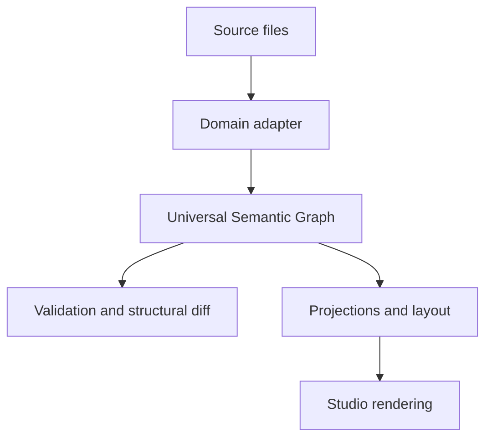

# Meridian

[](https://github.com/prithvirajmody/Meridian/actions/workflows/ci.yml)
[](LICENSE)

**A semantic graph platform for parsing, validating, comparing, and exploring structured knowledge.**

Meridian turns Markdown documents, TypeScript and Python code, chat exports, essays, and organization definitions into one shared Universal Semantic Graph. The CLI ingests, validates, and diffs those graphs. The Studio, a React and WebGL app, draws them as a zoomable map: zoomed out you see a document's sections or a codebase's packages, and zooming in opens them into paragraphs, modules, and functions. The same graph also has outline, matrix, and timeline views.

<!-- Screenshot slot: a Studio screenshot (docs/media/meridian-*.png) is added
     with the product-evidence pass. Do not substitute a test golden. -->

## Quick start

You need Node.js 24 and pnpm 11 (`corepack enable` installs the pinned pnpm 11.10.0). No API keys are needed, and after `pnpm install` nothing uses the network.

```bash
git clone https://github.com/prithvirajmody/Meridian.git && cd Meridian
pnpm install
pnpm dev
```

`pnpm dev` builds the workspace packages, then serves the Studio at <http://127.0.0.1:5173>. Use **Open corpus** to load a sample such as `fixtures/corpora/markdown/commonmark-edges.md` or `fixtures/corpora/conversation/claude-two-topics.json`. Scroll to zoom, and click a node to see its attributes and provenance. See [the Studio guide](apps/studio/README.md).

## What is left out, and why

- **Live AI output.** The `meridian ai` commands default to a deterministic mock and can replay recorded fixtures; neither touches the network. Live mode needs `--ai-consent` plus a local Claude Code or Codex CLI session, or an Anthropic or OpenAI key, so it is not part of the quick start. No live model output is committed: `evals/recordings/` stays empty until a person records and rates it.
- **The large scale corpus.** The Phase 7 scale test ingests [vuejs/core](https://github.com/vuejs/core) (about 150k lines). `fixtures/oss/fetch.sh` clones it outside the tracked tree, and only a count summary is committed.
- **A hosted demo.** There is none yet; the Studio runs locally.
- **Five browser performance budgets on CI.** GitHub's 2-vCPU runners cannot meet the frame-time, FPS, edit-to-pixel, and hydrated-navigation budgets, so CI measures and reports those five without failing on them. Every budget is still enforced in a local run. See [benchmarks/runner.json](benchmarks/runner.json) and [the profiling guide](docs/PERFORMANCE-PROFILING.md).

## What is implemented

| Layer | Repository components |
|---|---|
| Shared graph | Graph model, validation, encoding, operations, and storage |
| Extensibility | Versioned plugin API, plugin host, and conformance kit |
| Source adapters | Markdown, code, conversation, argument, and organization adapters |
| Exploration | React Studio, projections, layout, navigation, and rendering |
| Comparison | Structural graph differences and bridge-v1 provenance artifacts |
| Verification | Unit/property tests, goldens, evaluations, browser tests, and performance budgets |

The CI badge reflects `main`. [Actions](https://github.com/prithvirajmody/Meridian/actions) has the run history, and [the roadmap](docs/ROADMAP.md) lists the remaining work.

## Try the CLI

After `pnpm install` and `pnpm build`:

```bash
pnpm meridian ingest fixtures/corpora/markdown/links.md
```

The CLI also supports validation, statistics, inspection, mutation, watching, structural diffs, and plugin discovery. See [the CLI guide](apps/cli/README.md).

## Architecture



The shared graph separates source-specific parsing from visualization-specific projections. Plugin contracts and conformance checks keep adapters compatible with that boundary.

## Verification

```bash
pnpm test
pnpm run ci
```

Use `pnpm run ci`, not bare `pnpm ci`. The full script includes lint, type checks, dependency checks, build, tests, evaluations, browser tests, and benchmarks. Updating goldens is an explicit reviewed operation; see the package scripts and governing docs.

## Documentation

- [Architecture](docs/ARCHITECTURE.md)
- [Roadmap](docs/ROADMAP.md)
- [Architecture decisions](docs/adr/README.md)
- [Bridge-v1 contract](contracts/bridge-v1/README.md)
- [Plugin API](packages/plugin-api/README.md)
- [Public project overview](https://github.com/prithvirajmody/prithvirajmody.github.io#meridian--semantic-graph-platform)
- [Contributing](CONTRIBUTING.md) and [security policy](SECURITY.md)

## License

Meridian is released under the [MIT license](LICENSE). Vendored grammars, the DejaVu Sans font, and its glyph atlas keep their own licenses; see [THIRD_PARTY_NOTICES.md](THIRD_PARTY_NOTICES.md).
