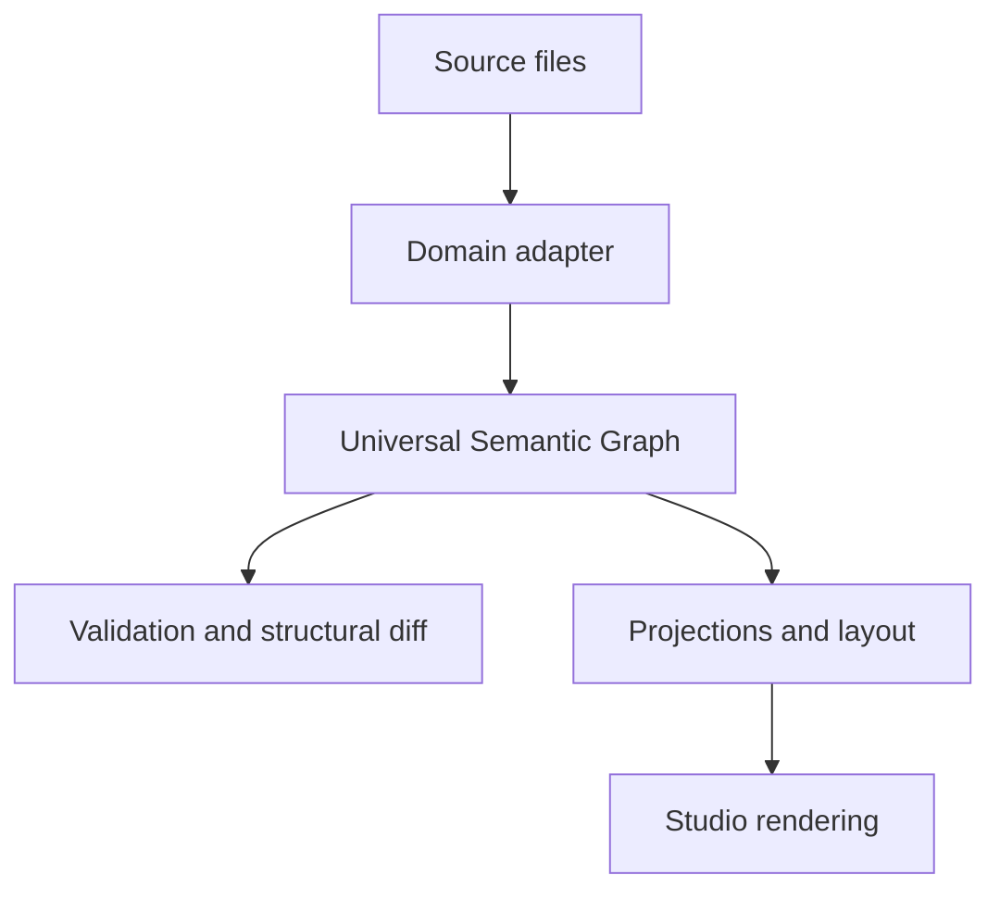

# Meridian

**A semantic graph platform for parsing, validating, comparing, and exploring structured knowledge.**

Meridian turns sources such as Markdown notes and code repositories into a shared Universal Semantic Graph. Its CLI validates and compares graphs; its React Studio provides a visual interface for exploring them.

## What is implemented

| Layer | Repository components |
|---|---|
| Shared graph | Graph model, validation, encoding, operations, and storage |
| Extensibility | Versioned plugin API, plugin host, and conformance kit |
| Source adapters | Markdown, code, conversation, argument, and organization adapters |
| Exploration | React Studio, projections, layout, navigation, and rendering |
| Comparison | Structural graph differences and bridge-v1 provenance artifacts |
| Verification | Unit/property tests, goldens, evaluations, browser tests, and performance budgets |

Implementation presence does not imply every current integration or CI gate passes. Consult [Actions](https://github.com/prithvirajmody/Meridian/actions) for recorded checks and [the roadmap](docs/ROADMAP.md) for remaining work.

## Try the Studio

Requires **Node.js 20+** and **pnpm 11.10.0**, as declared in package.json.

```bash
git clone https://github.com/prithvirajmody/Meridian.git
cd Meridian
pnpm install
pnpm build
pnpm dev
```

Open the URL printed by Vite. Use **Open corpus** to load a file under `fixtures/corpora/markdown/`. See [the Studio guide](apps/studio/README.md).

This is a private source repository; cloning requires access.

## Try the CLI

After installing and building:

```bash
pnpm meridian ingest fixtures/corpora/markdown/links.md
```

The CLI also supports validation, statistics, inspection, mutation, watching, structural diffs, and plugin discovery. See [the CLI guide](apps/cli/README.md).

## Architecture



The shared graph separates source-specific parsing from visualization-specific projections. Plugin contracts and conformance checks keep adapters compatible with that boundary.

## Verification

```bash
pnpm test
pnpm run ci
```

Use `pnpm run ci`, not bare `pnpm ci`. The full script includes lint, type checks, dependency checks, build, tests, evaluations, browser tests, and benchmarks. Updating goldens is an explicit reviewed operation; see the package scripts and governing docs.

## Documentation

- [Architecture](docs/ARCHITECTURE.md)
- [Roadmap](docs/ROADMAP.md)
- [Architecture decisions](docs/adr/README.md)
- [Bridge-v1 contract](contracts/bridge-v1/README.md)
- [Plugin API](packages/plugin-api/README.md)
- [Public project overview](https://github.com/prithvirajmody/prithvirajmody.github.io#meridian--semantic-graph-platform)
