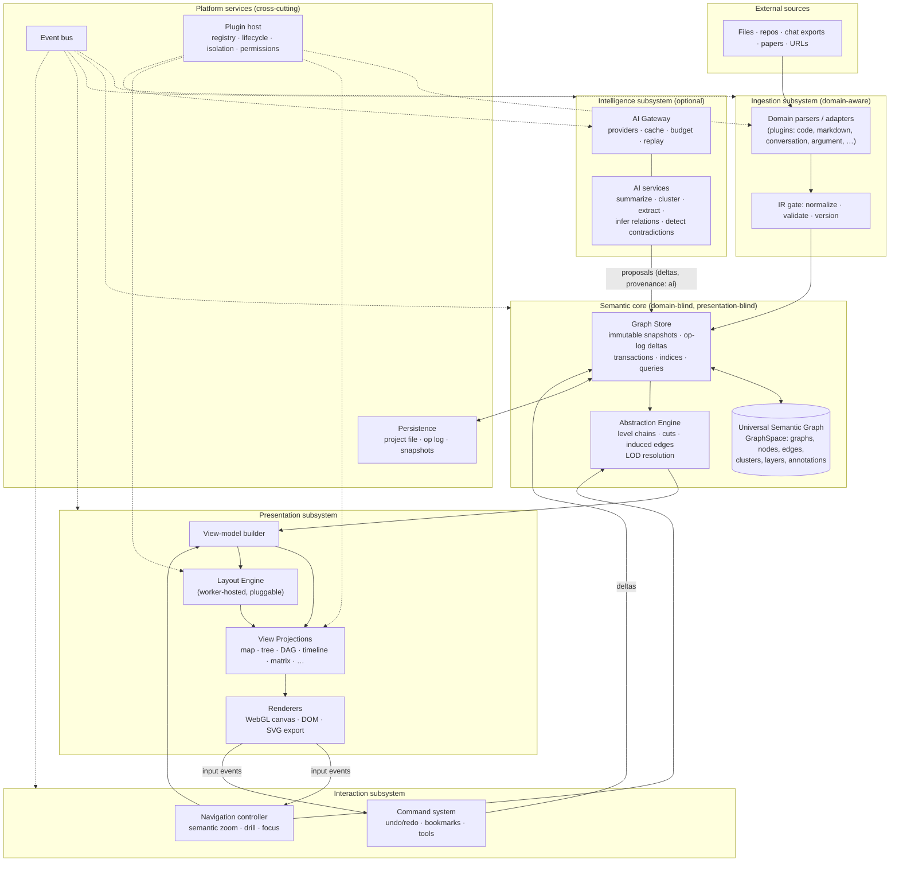

# Meridian — Architecture Specification

**Document role:** the architectural constitution. Every implementation
decision must either follow this document or amend it through an ADR.
**Status:** v1.0 draft, 2026-07-05. Companion to [ROADMAP.md](ROADMAP.md)
(the approved phased implementation plan). Where the roadmap says *when*,
this document says *what* and *why*.
**Codename:** *Meridian* (placeholder; the reference line by which position
is measured — the platform's job is to give reasoning a coordinate system).

**Reading contract.** This is a system-design document. It contains no
implementation code and no placeholder interfaces; interfaces are specified
*conceptually* — by responsibility, inputs, outputs, guarantees, and
forbidden behaviors. Type-level shapes live in the roadmap's phase specs and
are finalized in per-decision ADRs. When this document and any other
artifact disagree, this document wins until amended.

---

## Table of contents

1. [High-level system architecture](#1-high-level-system-architecture)
2. [Core design principles](#2-core-design-principles)
3. [Universal Semantic Graph (USG)](#3-universal-semantic-graph-usg)
4. [Recursive graph model](#4-recursive-graph-model)
5. [Semantic zoom architecture](#5-semantic-zoom-architecture)
6. [Intermediate Representation (IR)](#6-intermediate-representation-ir)
7. [Parser architecture](#7-parser-architecture)
8. [AI layer](#8-ai-layer)
9. [Rendering architecture](#9-rendering-architecture)
10. [Interaction architecture](#10-interaction-architecture)
11. [Layout engine](#11-layout-engine)
12. [State management](#12-state-management)
13. [Event system](#13-event-system)
14. [Plugin system](#14-plugin-system)
15. [Persistence](#15-persistence)
16. [Performance strategy](#16-performance-strategy)
17. [Error handling](#17-error-handling)
18. [Testing architecture](#18-testing-architecture)
19. [Security considerations](#19-security-considerations)
20. [Repository organization](#20-repository-organization)
21. [Future evolution](#21-future-evolution)
— [Architectural Decision Records](#architectural-decision-records-adrs)
— [Architecture risk assessment](#architecture-risk-assessment)
— [Implementation readiness checklist](#implementation-readiness-checklist)

---

## 1. High-level system architecture

### 1.1 The shape of the system

Meridian is an **hourglass**. Many domains flow in through parsers at the
top; many visualizations flow out through projections at the bottom; the
narrow waist is a single, domain-blind representation — the Universal
Semantic Graph (USG) and its Intermediate Representation. Everything above
the waist knows about domains and nothing about pixels. Everything below the
waist knows about pixels and nothing about domains. The waist knows about
neither; it knows about graphs, abstraction, and change.

This shape exists because the platform's economics demand it: N domains and
M visualization modes must cost N + M implementations, not N × M. Every
architectural rule in this document ultimately defends the waist.

### 1.2 Subsystem map



### 1.3 Subsystem charters

Each subsystem has a charter: what it owns, what it must never do, how it
talks, what it depends on, and how it lives and dies. These charters are the
ownership boundaries; a PR that moves a responsibility across a charter line
requires an ADR.

**Semantic Core** (packages: `graph-core`, `graph-store`, `abstraction`)
- *Responsibility:* define the USG; hold the only mutable authority over
  graph state; compute abstraction (cuts, induced edges, LOD) as pure
  functions over immutable snapshots.
- *Owns:* the data model, the op vocabulary, version identity, all graph
  invariants, all indices.
- *Must never:* import anything domain-specific, presentation-specific, or
  AI-specific; perform I/O (persistence is injected); block (heavy
  computation is pure and can therefore be moved to workers by callers).
- *Communication:* called synchronously (reads are snapshot reads; writes
  are delta submissions); emits change events after commit.
- *Dependencies:* none (leaf of the dependency graph).
- *Lifecycle:* created per open project; lives for the project session;
  destruction flushes the op log through Persistence.

**Ingestion** (packages: `plugin-api` parser capability, per-domain adapter
plugins, the IR gate inside `graph-core`'s codec)
- *Responsibility:* transform external sources into IR; keep transformed
  graphs current as sources change (watch/incremental mode).
- *Owns:* domain knowledge — vocabularies, mapping rules, source formats,
  incremental diffing against sources.
- *Must never:* write to the store directly (adapters emit IR
  documents/deltas into a sink; the host applies them through the one write
  path); retain references to store internals; block the UI thread (parsing
  runs in workers).
- *Communication:* pull-activated by the host (sniff → ingest), then
  push-driven in watch mode; progress and completion via events.
- *Dependencies:* `plugin-api` and the IR only.
- *Lifecycle:* per-source ingest sessions; watch mode holds a long-lived
  session that the host can suspend/resume/cancel.

**Intelligence** (packages: `ai`, `ai-services`; AI providers are plugins)
- *Responsibility:* upgrade abstraction quality — names, summaries,
  clusters, inferred relationships, contradictions, assumptions — via
  external or local models.
- *Owns:* provider adapters, prompt versioning, response caching,
  record/replay, budget enforcement, eval harnesses.
- *Must never:* be load-bearing (every consumer has a deterministic
  fallback); mutate the store directly (it emits *proposals* that become
  ordinary provenance-tagged deltas); leak content to a provider without the
  project's explicit egress consent (§19).
- *Communication:* asynchronous job model — request, progress events,
  proposal delivery; cancellable; budget-interruptible.
- *Dependencies:* semantic core (read-only snapshots), `plugin-api`.
- *Lifecycle:* stateless services over a per-project AI session that carries
  budget and consent state.

**Presentation** (packages: `view-model`, `layout`, `projections`,
`renderer`)
- *Responsibility:* turn (snapshot, LOD result, interaction state) into
  pixels, through three pure stages: view-model building → layout →
  projection rendering.
- *Owns:* all geometry, all GPU/DOM resources, visual encodings, label
  policy, culling.
- *Must never:* mutate graph state; hold the only copy of any state (all
  presentation state is reconstructible from graph state + view state);
  compute semantics (which nodes are visible is the Abstraction Engine's
  answer, not the renderer's).
- *Communication:* consumes view-models synchronously; layout runs in
  workers with cancellation; emits input events upward.
- *Dependencies:* semantic core types, view state.
- *Lifecycle:* per-view instances (a window/pane owns a projection
  instance); GPU resources bound to canvas lifecycle with loss/restore.

**Interaction** (packages: `navigation`, command system inside the app
shell)
- *Responsibility:* translate human intent into either navigation-state
  changes (zoom, focus, filter — ephemeral) or graph deltas (edits,
  accepted proposals — durable), and own semantic-zoom choreography.
- *Owns:* the command registry, undo/redo stacks, navigation history,
  bookmarks, selection semantics.
- *Must never:* bypass the command system (no component issues raw deltas
  in response to input); own rendering.
- *Communication:* receives input events from renderers; issues commands;
  observes store change events to keep interaction state consistent.
- *Dependencies:* semantic core, view-model, event bus.
- *Lifecycle:* per-view controllers over a per-project command log.

**Platform services** (packages: `plugin-api`, `plugin-host`, event bus
inside `graph-store`/app shell, `store-sqlite`, later `sync-protocol` +
`services/sync`)
- *Responsibility:* everything cross-cutting — plugin registration,
  lifecycle, isolation and permissions; the event bus; persistence; future
  sync.
- *Owns:* trust boundaries, the capability registry, durability.
- *Must never:* interpret domain or presentation semantics; the plugin host
  routes capabilities, it does not understand them.
- *Communication:* host APIs called by the app shell; events for lifecycle
  transitions.
- *Lifecycle:* process-long (host, bus) or project-long (persistence
  session).

### 1.4 Communication patterns — the three channels

All inter-subsystem communication uses exactly three patterns. Anything else
is a boundary violation:

1. **Snapshot reads (pull, synchronous).** Any subsystem may read an
   immutable snapshot of graph state at a version. Reads never block writes
   and never observe torn state.
2. **Deltas through the one write path (command → transaction, atomic).**
   All mutation — user edits, parser output, accepted AI proposals, imports,
   future remote ops — is expressed as typed operation lists applied
   transactionally. There is no second write API.
3. **Events (push, asynchronous, post-hoc).** Facts about what happened —
   committed changes, ingest progress, AI completion, layout ready. Events
   never carry authority: no subsystem may treat an event as a command, and
   handlers may not mutate state re-entrantly (they enqueue commands).

Why: pattern 1 makes reads scale and makes every computation testable as a
pure function; pattern 2 is what makes undo, incremental updates, audit,
persistence, and future collaboration all *the same feature*; pattern 3
decouples producers from the unbounded set of consumers a platform will
accumulate.

---

## 2. Core design principles

These are the constitution's articles. Every code review may cite them by
number. Amending one requires an ADR that explains what changed in our
understanding.

**P1 — The core is domain-blind and presentation-blind.**
`graph-core`, `graph-store`, and `abstraction` may not contain a single
domain word ("function", "message", "premise") or presentation concept
(pixel, color, DOM). Domains speak through namespaced vocabulary
(`code:function`); presentation speaks through derived view-models. This is
mechanically enforced (dependency rules + string audits in CI), not merely
encouraged. *Why:* the hourglass waist (§1.1) is the platform's entire
economic argument; blindness is what keeps it narrow.

**P2 — One write path: everything is an operation.**
Every mutation is a typed, invertible operation in an ordered log, applied
atomically with validation. No exceptions for "internal" or "convenience"
writes. *Why:* undo/redo, incremental view updates, autosave, crash
recovery, diffing, audit, and multiplayer are all projections of one op log.
Systems that grow a second write path pay for each of those features twice.

**P3 — Immutable snapshots; mutation produces new versions.**
Readers hold structurally-shared immutable snapshots identified by version
stamps. *Why:* concurrency without locks, caching keyed by version instead
of by prayer, time-travel and diff for free, and pure-function testability
of everything downstream of the store.

**P4 — Parse, don't validate, at every trust boundary.**
Data crossing a boundary (file → IR, plugin manifest → host, AI response →
proposal, network → sync) is parsed into typed structures by a schema; what
doesn't parse doesn't enter. Inside a boundary, types are trusted. *Why:*
boundary parsing concentrates defensive code where attacks and corruption
actually arrive, and keeps interior code free of paranoia.

**P5 — Plugin-first: built-ins are plugins.**
Every extensible capability — parsers, projections, layouts, AI providers,
exporters, themes, tools, analytics, validators — is defined as a plugin
capability, and the first-party implementations register through the same
contract third parties will use. *Why:* an extension API that the core team
doesn't live on is an extension API that doesn't work; dogfooding is the
only honest conformance test.

**P6 — AI is an enhancement, never a dependency.**
Every feature that AI improves must exist, functional, without it:
deterministic summarizer fallbacks, containment-based abstraction, skeleton
parsing without enrichment. AI output is always provenance-tagged, always
filterable, and enters the graph only as proposals through the one write
path. *Why:* offline operation, cost control, testability (CI runs with
zero network), user trust, and provider independence all follow from this
single stance.

**P7 — Composition over inheritance; capabilities over base classes.**
Extension points are small interfaces plus capability descriptors, not
abstract classes to subclass. Behavior variation is composed (a projection
*uses* a layout provider; an adapter *uses* an extractor), never inherited.
*Why:* inheritance couples extension authors to our internals and makes
versioning the contract (P12) nearly impossible.

**P8 — Semantics are pure functions.**
LOD resolution, induced-edge aggregation, cut diffing, transition planning,
view-model building, layout (given a seed) — all pure: same inputs, same
outputs, no hidden state. Impurity (I/O, GPU, network, clocks) is pushed to
the edges. *Why:* purity is what makes the hardest parts of this system —
semantic zoom correctness, incremental invalidation — testable by property
checks and reproducible from bug reports.

**P9 — Progressive enhancement and graceful degradation.**
The platform runs: without AI (P6), without GPU (fallback DOM/SVG rendering
at reduced scale), without network (fully local), without persistence
(in-memory + export), and with any subset of plugins. Each degradation is
explicit, user-visible, and tested — not an accident of error handling.
*Why:* a platform's environments are not enumerable in advance.

**P10 — Provenance everywhere.**
Every node, edge, and attribute knows where it came from: parsed from
source (with location), derived deterministically (with rule), proposed by
AI (with model, prompt version, confidence), or authored by a user (with
actor). Provenance is queryable and filterable at every level of the UI.
*Why:* a reasoning tool that cannot distinguish evidence from inference from
speculation is a misinformation tool.

**P11 — Events describe the past; commands request the future.**
Event names are past-tense facts (`graph.changed`, `ingest.completed`).
Anything that *causes* change is a command with an issuer, and commands are
the only input to the write path. *Why:* this one naming discipline prevents
the slow slide into event-soup architectures where causality is
unrecoverable.

**P12 — Interfaces are versioned contracts.**
The plugin API and the IR carry explicit versions; breaking changes happen
only at declared checkpoints with migration notes; API surface is snapshot-
tested so accidental breaks fail CI. *Why:* a platform's most valuable asset
is other people's code written against it; that asset exists only if
contracts hold.

**P13 — Performance is a contract, not a hope.**
Scalability targets (§16) are encoded as CI-gated benchmarks with pinned
budgets. A regression is a failing test, not a future ticket. *Why:*
performance lost gradually is unrecoverable practically; budgets make the
loss visible at the commit that caused it.

---

## 3. Universal Semantic Graph (USG)

The USG is the platform's ontology — the complete set of things that can
exist. This section defines each object's *responsibility* (what questions
it answers), its relationships to the others, and the invariants that bind
them.

### 3.1 The object model

**GraphSpace** — the universe of one project. A flat collection of Graphs
plus the identity, version, and history apparatus around them. *Responsible
for:* answering "what graphs exist," resolving every reference, and being
the unit of persistence and versioning. There is exactly one GraphSpace per
open project; "flat" is load-bearing and justified in §4.

**Graph** — a bounded set of Nodes and Edges with its own metadata
(originating domain, label, provenance). *Responsible for:* being the unit
of containment (a node's detail is a Graph), the unit of lazy loading, and
the namespace within which edges are permitted. A Graph does not know who
contains it; the containment relation is owned by the space (one canonical
direction of truth, no bidirectional sync bugs).

**Node** — the atom of meaning: anything a domain considers an entity — a
function, a message, a claim, a proof step, a process stage. *Responsible
for:* carrying its kind (namespaced), its human label, its Metadata, its
Identity, its provenance, and optionally a reference to the Graph that
refines it (its detail). Nodes are meaning, never geometry: a node has no
position, size, or color — those belong to Views and layout results.

**Edge** — a directed, typed connection between two Nodes *of the same
Graph*. *Responsible for:* carrying its Relationship kind, optional weight,
Metadata, and provenance. The same-graph restriction is an invariant with a
dedicated mechanism for everything it seems to forbid (§4.3).

**Relationship** — not an object but the *taxonomy* governing edge kinds.
Two tiers: a small **core taxonomy** the platform itself understands and can
reason about generically — `contains` (implicit, via detail refs),
`refines`, `references`, `precedes`, `supports`, `contradicts`, `derives` —
and open **namespaced domain kinds** (`code:calls`, `arg:rebuts`,
`proof:justifies`) that domains declare, optionally mapping them onto core
kinds (`arg:rebuts` ⇒ `contradicts`). *Why two tiers:* generic features
(contradiction surfacing, ordering-aware layouts, dependency tracing) need a
vocabulary they can rely on across domains, while domains need unlimited
expressiveness. The mapping is declared in the parser's manifest, so the
platform gets cross-domain semantics without inspecting domain internals.

**Cluster** — a *derived grouping* of nodes proposed by an algorithm, an AI
service, or a user — the mechanism by which flat regions of a graph acquire
hierarchy. A Cluster materializes as an ordinary group Node (kind
`core:cluster`) whose detail Graph contains the members, created through the
one write path with provenance saying who grouped and why. *Responsible
for:* recording membership, rationale, and confidence. *Why materialized
rather than kept as a separate overlay:* once materialized, clusters
participate in cuts, induced edges, layout, and persistence with zero
special cases — the abstraction machinery has exactly one hierarchy to
compute over. The cost (clusters occupy the containment forest) is governed
by the rule that cluster nodes are always distinguishable (kind +
provenance) and always dissolvable (the inverse delta restores the flat
region).

**Layer** — a named, toggleable *overlay set* of elements and attributes
that annotate the base graph without being part of its structure: the
annotation layer, the AI-enrichment layer, a diff layer (comparing two
versions), a runtime-trace layer, an analytics layer (computed metrics).
*Responsible for:* letting orthogonal information coexist without polluting
structural semantics — a layer can be hidden, exported, or discarded
wholesale. Structurally, a layer is a tagged subset: elements carry layer
membership, and the view pipeline filters by active layers. *Why not
separate graphs:* layer elements reference base nodes constantly; keeping
them in-space makes those references ordinary and cheap, while the tag keeps
them separable.

**Abstraction** — the machinery of §5, named here as an object family:
**LevelChain** (a domain's ordered, named levels — project→…→expression),
**Refinement** (the abstract-node ⇄ detail-graph mapping, derived from
containment), and **Cut** (a complete horizontal slice — the set of nodes
visible at one abstraction state). *Responsible for:* making "level of
abstraction" a computable value rather than a UI mood.

**View** — a saved, shareable perspective: an abstraction state (cut/zoom +
overrides + focus) + a projection choice + its view state (camera or
equivalent) + active layers + filters. *Responsible for:* making
"what I am looking at" a first-class, serializable, versionable value —
which is what makes links, bookmarks, synchronized panes, and collaborative
presence all representable identically. Views hold *no* graph data; a View
over a changed graph re-resolves (and degrades gracefully if its focus was
deleted).

**Annotation** — user commentary (note, flag, question, rating) attached to
an Identity — a node, edge, or View — not to a position. Lives in the
annotation Layer, carries actor provenance, and survives re-ingestion
precisely because identities are stable (§3.2). *Responsible for:* the human
conversation *about* the graph, kept separable from the graph.

**Metadata** — the attribute bag on every element: a small set of
platform-typed core attributes (label, timestamps, salience, layer tags)
plus namespaced domain attributes (`code:cyclomatic`, `conv:tokens`)
validated by schemas the owning plugin registers. *Responsible for:*
unlimited domain expressiveness without schema anarchy — an attribute
namespace without a registered schema is rejected at the IR gate (P4).

**Identity** — the stable ID discipline. IDs are deterministic functions of
semantic coordinates — `(domain, source, semantic-path)` — not random. The
same function in the same file across two ingests yields the same NodeId.
*Responsible for:* making incremental updates diffable, annotations
survivable, Views durable, and cross-run comparison possible. Renames
produce remove+add in v1, with an alias table reserved as the future
mechanism for identity continuity across renames (roadmap ADR-0028).

**Versioning** — every committed transaction advances the GraphSpace's
version stamp: a monotonic, totally-ordered value (with reserved structure
for a site component, so future multi-writer ordering extends rather than
replaces it). Every snapshot, cache entry, layout, and View pin references a
version. *Responsible for:* being the single temporal coordinate for the
entire system.

**History** — the op log itself: the ordered, invertible record of every
delta with origin (which command, which actor, which plugin, which AI
proposal). *Responsible for:* undo/redo, crash recovery (replay from
snapshot), diff between versions (compose the ops between them), audit
("who added this edge and why"), and — later — synchronization (§21).
History is durable (§15) and is the *primary* persistence artifact, not a
side file.

### 3.2 Invariants (must always hold)

Committed automatically by every transaction; violation aborts the
transaction (dev: hard failure; prod: §17.4 quarantine):

- **U1 Referential integrity.** Every edge endpoint resolves to a node in
  the same graph; every detail reference resolves to a graph in the space;
  every layer/annotation/cluster reference resolves.
- **U2 Acyclic containment.** The graph-contains-graph relation is a
  forest. No graph is its own ancestor. (Domain cycles — recursion, circular
  arguments — are ordinary *edges* and are fine; containment is not the
  place to model them.)
- **U3 Single ownership.** Every node and edge belongs to exactly one
  graph; every graph has at most one containing node.
- **U4 Deterministic identity.** Re-deriving an element's ID from its
  semantic coordinates yields its stored ID.
- **U5 Total version order.** Every committed change has a unique stamp;
  snapshots are exact; no reader ever observes a partial transaction.
- **U6 Invertibility.** Every op in the log carries what it needs to be
  inverted; composing a delta with its inverse is identity.
- **U7 Provenance completeness.** No element without an origin. "Unknown"
  is not a valid origin.
- **U8 Vocabulary discipline.** Every kind and attribute namespace is
  either core or declared by a registered schema.

### 3.3 What must never be allowed

An explicit blacklist, because these are the mutations that quietly destroy
platforms:

- **No geometry in the USG.** Positions, colors, sizes never enter graph
  state. (Manual layout pinning, when it comes, is *view* state.)
- **No cross-graph edges.** See §4.3 for what to do instead.
- **No mutation outside the op path** — including by plugins, including by
  the AI layer, including "just this once" by the core team.
- **No domain enums in the core.** The day `graph-core` contains
  `case 'code:function'` the hourglass is broken.
- **No unversioned external surface.** Documents, plugin APIs, and sync
  messages always carry a version field, from v1.
- **No AI output entering silently.** Un-provenance-tagged or auto-accepted-
  without-configuration AI mutations are forbidden.
- **No synchronous cross-subsystem callbacks that mutate.** Event handlers
  enqueue commands; they never write.

---

## 4. Recursive graph model

### 4.1 The representation decision: flat space, reference-based recursion

Recursion is represented by a **flat GraphSpace** in which nodes carry an
optional *detail reference* to another graph in the space — never by
physically nesting graph documents inside node payloads.

*Why (this is the single most consequential decision in the platform):*

- **Lazy loading becomes a pointer discipline.** A detail reference to a
  graph that isn't hydrated yet is representable and cheap; a physically
  nested document must be parsed to be skipped.
- **Structural sharing works.** Immutable snapshots share unchanged graphs
  by reference; nesting would force deep copies along every ancestor path
  on every change.
- **Deltas stay local.** An op touching a deep node addresses
  `(graphId, nodeId)` — two lookups — rather than a path through every
  ancestor document.
- **Traversal is honest about cost.** Walking into detail is an explicit
  dereference the caller controls, not an accident of object shape.

The tradeoff accepted: referential integrity must be *maintained* (U1)
rather than being structurally impossible to violate, and serialization must
order graphs for streaming. Both costs are paid once, in the store and
codec; nesting's costs would be paid everywhere, forever.

### 4.2 Parent–child relationships

The containment relation ("graph G details node N") is stored once, owned by
the GraphSpace, and forms a forest (U2, U3). Derived accessors answer both
directions (node → detail graph; graph → containing node) from the one
canonical record. Roots — graphs contained by no node — are the entry points
of a project (typically one per ingested source).

Children do not know their parents *semantically*: a function's graph is the
same graph regardless of which module contains it. This keeps refactoring
(moving a node between parents) a small delta rather than an identity
change.

### 4.3 Cross-graph references — the portal rule

Real domains constantly need to point across containment boundaries: a call
from `moduleA.f` to `moduleB.g`, a message citing an earlier topic, a proof
step invoking a lemma proved elsewhere. Raw cross-graph edges are forbidden
(U-list, §3.3) because they would make every graph's integrity depend on
every other graph's hydration state, and would make induced-edge computation
(§5.3) a special case instead of the general rule.

Instead, the **portal rule**: a conceptual link between nodes in different
graphs is recorded as an edge *at the lowest common graph* of the two
containment paths, connecting the two ancestors that are siblings there,
carrying the precise deep endpoints as metadata (`via` coordinates). At any
abstraction cut, the link is then *induced* to whatever ancestors are
visible — the same aggregation machinery that powers semantic zoom, with no
second mechanism. When the user drills deep enough that both true endpoints
are visible in their own graphs, the presentation layer renders the link as
a **portal**: an edge to a boundary marker ("→ moduleB.g") that can be
followed, changing focus context on traversal.

*Tradeoff:* deep links are slightly more expensive to record (the ingest
sink computes the lowest common graph — a cheap forest walk) in exchange for
every graph remaining independently loadable, verifiable, and evictable.

### 4.4 Cycles

- **Containment cycles: never** (U2). The IR gate rejects them; the store
  rejects them; the fuzzer tries to create them.
- **Edge cycles within a graph: always legal.** Call cycles, circular
  citations, mutually-rebutting arguments are real semantics. Consumers
  that need acyclicity (layered layouts, topological orderings) compute a
  condensation or feedback-arc approximation *in the presentation layer* —
  the model never lies about the domain to make a layout easier.
- **Reference cycles across graphs (A's deep link targets B, B's targets
  A): legal** — portals are data, not containment.

### 4.5 Shared nodes

A node belongs to exactly one graph (U3). Apparent sharing — the same
utility function relevant to five modules, the same claim appearing in two
debates — is modeled as one *owning* occurrence plus `references` edges
(portal rule) from the other contexts, optionally rendered as ghost
occurrences by projections. *Why single ownership:* shared mutable
membership is the classic source of update anomalies (which containment
path wins in a cut? who may delete it?). Reference edges preserve the
semantics ("this is the same thing") while keeping ownership, identity, and
lifecycle unambiguous. If a future domain genuinely requires multi-parent
containment (true DAG hierarchies), that is an ADR-level amendment with a
redesign of cut semantics — not a quiet exception.

### 4.6 Graph ownership and lifecycle

Every graph has an owner of record in its provenance: the parser session,
AI proposal, or user action that created it. Ownership governs lifecycle:
re-ingesting a source may replace graphs owned by that source's parser
(via diffed deltas), but never touches user-owned or AI-proposal-owned
graphs attached to them. This is what makes "refresh from source" safe in a
space that mixes parsed truth with human and AI additions.

### 4.7 Lazy loading, streaming, and memory

Every graph carries a hydration state: **cold** (identity + summary metadata
only — enough to render as a closed node and to size it), **hydrating**,
**live**, or **evictable** (live but unobserved). The store's read API makes
state visible; the *DetailResolver* capability (a plugin contract) is how
cold graphs materialize — from the persistence backend, from a re-parse
(AST-on-demand), or from an AI extraction.

Rules:

- **Cuts never block on cold graphs.** A cold detail renders as an
  unexpanded node; expansion triggers hydration; the LOD resolver treats
  "cold" as "collapsed by necessity" and says so in its trace.
- **Streaming ingest is the only ingest.** Parsers emit incremental deltas
  (a complete document is just one big delta); the store applies them in
  bounded-memory batches with progress events. There is no "load the whole
  thing then commit" path to fall back onto, so scale problems surface in
  development, not at the first big customer file.
- **Eviction is safe by construction.** Because graphs are immutable
  snapshots over a durable op log, evicting a hydrated graph loses nothing;
  it returns to cold with its summary metadata retained. Eviction policy
  (LRU by observation, protected sets for pinned/undo-relevant graphs) is a
  tunable, not a correctness concern.

### 4.8 Traversal strategies

Three sanctioned traversal modes, each with a contract:

1. **Intra-graph traversal** — adjacency walks within one graph, backed by
   incremental indices; O(degree) per step; never triggers I/O.
2. **Containment traversal** — walks on the containment forest (ancestors,
   descendants, common-ancestor queries); O(depth); never triggers I/O
   (the forest is always fully resident — it is small).
3. **Deep traversal** — semantic walks that cross detail boundaries
   (e.g. "trace this call chain to the bottom"). Explicitly asynchronous,
   explicitly budgeted (max nodes, max hydrations), cancellable, and
   yielding incrementally. This is the only traversal allowed to hydrate.

*Why the taxonomy:* mixing "cheap and sync" with "expensive and async" in
one API is how UIs freeze. The type system makes the third kind impossible
to call casually.

---

## 5. Semantic zoom architecture

### 5.1 The formalism: zoom is a cut

The containment forest (base structure + materialized clusters) defines the
hierarchy. An **abstraction state** is:

- a global **zoom scalar** *z* ∈ [0, 1] mapped through the active
  **LevelChain** to a base level,
- plus a set of **per-node overrides** (pin, expand, collapse),
- plus a **focus** (the node/graph the user is "at"),
- plus a **node budget** (viewport capacity).

The **LOD resolver** — a pure function (P8) — maps abstraction state to a
**Cut**: the antichain of visible nodes covering every leaf exactly once,
with an accompanying **trace** explaining every inclusion (level, override,
budget degradation, cold-graph collapse). Everything the user sees is a
rendering of a Cut plus its induced edges.

*Why a formalism at all:* "zoom changes abstraction" is only true, testable,
consistent across domains, and computable off the UI thread if abstraction
state is a value and resolution is a function. The trace requirement exists
because LOD bugs are otherwise undiagnosable ("why is this node hidden?"
must have an answer).

### 5.2 Abstraction levels: three sources, one precedence order

1. **Structural levels** — from containment as parsed (document → section →
   paragraph). Always present; the deterministic floor (P6).
2. **Generated levels** — clusters proposed by algorithms (community
   detection over embeddings or connectivity) or AI services, materialized
   as cluster nodes with provenance and confidence.
3. **User-defined levels** — manual grouping, renaming, dissolving,
   re-parenting through ordinary commands.

Precedence when they conflict: **user > generated > structural** — a user's
dissolution of an AI cluster is itself an op with provenance, so precedence
is simply log order plus the rule that enrichment passes never overwrite
user-touched regions (they detect user provenance and propose alongside,
not on top). *Why:* the hierarchy is the user's mental model being built;
tools that fight the user's explicit structure destroy trust permanently.

### 5.3 Semantic compression: induced edges and summarized content

When a cut hides detail, information must *aggregate*, not vanish:

- **Induced edges.** Every edge between hidden nodes appears as a weighted,
  typed edge between their visible ancestors, with multiplicity and sampled
  witnesses ("12 calls, e.g. f→g"). Aggregation groups by relationship
  kind; the core taxonomy mapping (§3.1) lets even domain-specific kinds
  aggregate meaningfully. Caps with "+n more" prevent hub explosions.
- **Summarized nodes.** A collapsed node presents a label and summary. The
  deterministic floor: dominant-child labeling, size/kind statistics
  ("Module · 24 functions"). The AI upgrade: generated names and abstracts
  (P6, §8), visually attributed as such.
- **Expansion** is the inverse: a cut change that replaces an ancestor with
  its children (or, for cold graphs, hydration then replacement).

### 5.4 Zoom dynamics: thresholds, hysteresis, anchors

- The scalar-to-level mapping has **hysteresis**: crossing a threshold
  upward and downward uses offset trigger points, so hovering at a boundary
  never flaps.
- **Anchor preservation** (the Google-Maps rule): the world point under the
  cursor at a threshold crossing is mapped through the refinement so that
  the same *semantic location* stays under the cursor after the cut swap.
  This one rule is most of "it feels like Maps."
- **Transitions** are planned by a pure choreographer: cut-diff →
  enter/exit/move sets → animation plan (children spawn from parent rects;
  exiting merges collapse into their ancestor; moves tween). Hard budget:
  a transition degrades to cross-fade before it degrades frame rate.
- **Drill-in vs zoom** are distinct verbs: continuous zoom moves the cut;
  explicit drill-in (double-click/enter) *changes context* — the focused
  node's detail graph becomes the working root. Both exist because
  continuous zoom communicates *scale* while drill-in communicates
  *scope*; conflating them is a known failure mode of zoomable UIs.

### 5.5 Caching and progressive loading

Keyed by `(version, abstraction-state-hash)`, three cache tiers: cut
results, induced-edge aggregations, and layouts. Invalidation is driven by
committed ChangeSets — a change touching graph G invalidates only cache
entries whose cuts intersect G's ancestry (the trace records dependencies,
so invalidation is exact, not conservative). Progressive loading: the
resolver's *frontier* (what would appear next on zoom-in) is speculatively
hydrated and laid out at idle priority, so the common gesture — zooming
into what you're looking at — hits warm caches.

### 5.6 Context preservation and navigation model

- **Focus + context:** per-node overrides let one region open deep while
  siblings stay summarized — the cut machinery natively supports mixed
  depth; no separate "fisheye" subsystem.
- **Breadcrumbs** are the containment path of the current focus/context
  stack, always derived (never stored), therefore always truthful.
- **Navigation history** is a stack of complete abstraction states +
  view references — browser-like back/forward over *places*, entirely
  separate from edit undo (§10.5). Bookmarks are named, persisted Views
  (§3.1).
- **The whole navigation state is serializable** — to a URL fragment, a
  bookmark, a shared link, or (later) a presence broadcast. "Where I am" is
  a value (P8 applied to navigation).

---

## 6. Intermediate Representation (IR)

### 6.1 Why the IR exists

The IR is the waist of the hourglass in serialized form: the *only* format
parsers may emit and the only format the core accepts. It exists so that:

- parser authors need zero knowledge of the store, caching, or rendering;
- the core can enforce every invariant at one gate (P4) instead of trusting
  N parsers;
- graphs are portable across processes, machines, and time (import/export,
  test fixtures, sync payloads, and cache artifacts are all IR);
- the platform can evolve internals freely behind a versioned exterior
  (P12).

The IR **is the USG's document form** — not a third model. One conceptual
model with an in-memory form and a wire form; a separate "true IR" would
drift from both.

### 6.2 Structure and required fields

An IR payload is either a **document** (complete description of one or more
graphs) or a **delta** (an op list against a stated base version) — the
same duality as the store's own read/write model, so ingest and sync are
the same machinery.

Required on every document: format version; producer identity and version
(which parser/plugin, for forensics); the graph set with, per graph:
identity, metadata, nodes, edges; containment declarations; and provenance
on every element (U7). Required on every delta: base version, op list,
origin.

Optional: layer memberships, annotations, level-chain declarations,
attribute schemas (may also be registered out-of-band by the plugin),
summary metadata for cold-loadable graphs, and embedded detail-resolver
hints (how to materialize lazily — e.g. "re-parse file X range Y").

### 6.3 Normalization

The IR gate normalizes before validation so that equality is meaningful:
canonical key ordering, canonical ID derivation checks (U4), deduplicated
attribute schemas, sorted element order by ID, canonicalized unicode in
labels. *Why:* byte-stable serialization is what makes golden-file testing,
content-hash caching (AI layer), and deterministic-ingest guarantees
(same source → identical document) possible.

### 6.4 Validation

Two passes at the gate, in order: **structural** (schema parse — does every
field have the right shape) then **semantic** (invariants U1–U8 — do the
references resolve, is containment acyclic, are namespaces registered).
Errors are located (element ID + field), aggregated (all errors, not first
error), and typed (so tooling can distinguish "parser bug" from "unregistered
namespace"). Nothing that fails either pass touches the store.

### 6.5 Serialization, extensibility, versioning, migration

- **Serialization:** JSON is the v1 wire form — diffable, debuggable,
  universal. The format is designed columnar-friendly (flat element arrays,
  no deep nesting — a benefit of §4.1) so a binary/compressed encoding can
  be added later as a pure codec swap without a model change.
- **Extensibility:** exactly one mechanism — namespaced kinds and
  attributes with registered schemas (U8). No "extra" free-form field, no
  alternate extension channels; one mechanism can be validated, documented,
  and migrated.
- **Versioning:** integer `formatVersion`, bumped only for breaking shape
  changes; additive optional fields do not bump.
- **Migration:** pure functions v(n) → v(n+1), chained, shipped with the
  codec forever; every historical fixture in the test corpus is retained at
  its original version and must migrate cleanly to current in CI. *Why
  chained single-step:* N migrations are written once each; direct
  any-to-current migration requires O(N²) paths and dies of neglect.

---

## 7. Parser architecture

### 7.1 Position in the system

Parsers (the roadmap calls them domain adapters — the terms are synonyms;
"parser" is the plugin-facing name) are plugins implementing the
`domain-parser` capability: **source in, IR out, nothing else.** They run in
workers, they hold no store references, and their entire output passes
through the IR gate. A parser that crashes takes down one ingest session,
never the application.

### 7.2 Lifecycle

1. **Register** — manifest declares the capability, the domain vocabulary
   (kinds, attribute schemas, relationship mappings to the core taxonomy),
   and a LevelChain spec.
2. **Sniff** — given a source descriptor, return a confidence score.
   The host arbitrates among claimants (user override always available).
3. **Ingest (skeleton pass)** — deterministic transformation of the source
   into IR, streamed as deltas. This pass must succeed without AI, without
   network, and must be reproducible byte-for-byte (P6, §6.3).
4. **Enrich (optional passes)** — AI-assisted structure (topics, claims,
   clusters) emitted as *proposals* via the AI layer's pathway, separately
   cacheable and re-runnable. The two-pass split is the platform's standard
   pattern for AI-native domains: skeleton = truth, enrichment = suggestion.
5. **Watch (optional)** — for live sources: consume source-change
   notifications, re-derive minimally, emit small deltas (stable identity,
   U4, is what makes the deltas small).
6. **Dispose** — cancel cleanly, release workers; an interrupted ingest
   rolls back atomically (one write path = transactional ingest for free).

### 7.3 Domain notes (what each teaches the contract)

- **Code** — the stress test: scale (lazy AST/CFG via DetailResolver),
  density (portal-rule links for imports/calls), change rate (watch mode),
  and precision honesty (syntactic call edges carry confidence metadata).
- **Markdown / documentation** — the deterministic exemplar: pure structure,
  the conformance baseline every contract change re-validates against.
- **JSON / structured data** — near-trivial mapping; earns its place by
  testing *degenerate* hierarchies (10k-sibling arrays force the budget and
  clustering machinery to do their jobs).
- **LLM conversations** — deterministic skeleton (sessions, turn threading
  from export formats) + AI enrichment (topics, claims, refers-back edges);
  the reference implementation of the two-pass pattern.
- **Research papers** — structure (sections, figures, citations)
  deterministically; claims/evidence via enrichment; citations are portals
  to other documents — the first *cross-root* linking domain.
- **Arguments / debates** — maximal enrichment reliance with a
  paragraph/sentence skeleton floor; the domain that most exercises
  `supports`/`contradicts` core semantics.
- **Future parsers** (agent workflows, proofs, business processes,
  knowledge graphs) — each declares vocabulary + levels + mappings in its
  manifest; *the test of this architecture is that none of them require a
  core change.* Proofs come closest to straining it (justification structure
  is a DAG) — handled as edges + levels, with §4.5's escape hatch documented
  if genuinely multi-parent containment ever proves necessary.

### 7.4 Parser quality gates

Every parser — first- or third-party — must pass the conformance kit:
IR-validity on its corpus, determinism of the skeleton pass, identity
stability under no-op re-ingest, incremental minimality where watch mode is
claimed (whitespace edit → empty delta), and crash containment (fuzzed
inputs may fail the ingest, never the host).

---

## 8. AI layer

### 8.1 Role and stance

AI performs the cognitive work humans would otherwise do to *organize*
reasoning: naming and summarizing collapsed regions, clustering flat
regions into semantic groups, extracting structure from unstructured text,
inferring relationships (this section elaborates that claim), detecting
contradictions between claims, surfacing unstated assumptions, and — as
advisory input only — suggesting layout emphasis (what deserves salience).

The stance is fixed by P6 and P10 and is non-negotiable:

1. **Every AI-enhanced feature has a deterministic floor.** No AI → the
   platform still parses, zooms, renders, and edits; summaries fall back to
   statistics, clustering to connectivity algorithms, extraction to
   skeleton passes.
2. **AI writes nothing.** Services emit *proposals*; accepted proposals
   become ordinary deltas tagged `origin: ai` with model, prompt version,
   input hash, and confidence. Acceptance is human-in-the-loop by default,
   auto-accept is per-project, per-service opt-in.
3. **AI-derived structure is always visually distinguishable and globally
   filterable.** One toggle shows the graph as evidence-only.

### 8.2 Provider architecture

The `ai-provider` plugin capability abstracts vendors. A provider declares
its **capability descriptor**: which task classes it supports (completion
with structured output; embeddings), model catalog with cost/context
metadata, and constraints. The gateway routes by a **task-class policy
table** — e.g. extraction/summarization → the configured primary
completion model; bulk short labeling → the configured economy model;
embeddings → the embedding provider — with per-project overrides. Multiple
providers coexist; routing is configuration, not code.

*Built-in adapters* (v1 ships two, on equal footing; the vendors are examples,
not architectural commitments — ADR-0029): an **Anthropic** adapter and an
**OpenAI** adapter, each confined to its own module and normalizing structured
output, usage, stop reasons, and errors into the gateway's neutral vocabulary.
The reference completion split is a configured primary model
(e.g. `claude-opus-4-8` or a GPT-class model) for extraction and summarization
and an economy model for bulk labels — with structured outputs validated
against the same schemas the IR gate uses, batch endpoints for whole-corpus
enrichment, and prompt caching for the shared graph-context prefix where the
vendor offers them. Shipping *two* built-in adapters keeps the seam honest;
which provider and model serve a task role, and the embedding provider, are
configuration (§8.2 policy table). A local-model provider is an expected early
third-party plugin; the architecture must never assume network presence (P9).

### 8.3 The gateway's non-negotiable services

Between every service and every provider sit, in order:

1. **Consent check** — remote egress requires the project's explicit
   data-egress consent (§19.3); local providers bypass this check only if
   verifiably local.
2. **Cache** — content-addressed by (prompt-template version, canonical
   input hash, model). The cache doubles as the **record/replay** store:
   CI runs in replay mode where a cache miss is a test failure, never a
   network call. This is what makes AI-dependent behavior deterministic and
   testable (P8 extended to AI).
3. **Budget guard** — per-project and per-session token/currency ceilings;
   hard stop mid-operation leaves valid, partially-enriched state, clearly
   marked; the user decision to continue is explicit.
4. **Schema enforcement** — every graph-shaped response parses against a
   registered schema (P4); one automated repair attempt, then rejection
   with the raw response retained for diagnostics.
5. **Resilience** — rate-limit backoff, provider failover per the routing
   policy, refusal/timeout handling — all invisible to services except as
   latency and result-or-typed-failure.

### 8.4 Service catalog (v1)

- **Summarizer** — names + abstracts for collapsed nodes, batch-oriented,
  operating on cut-shaped work units so cost tracks what users actually see.
- **Clusterer** — embeddings + community detection → cluster proposals with
  labels and confidence.
- **Structure extractor** — text → IR-shaped graph proposals
  (claims/premises/topics); the engine behind AI-native parser enrichment.
- **Relationship inferencer** — proposes typed edges between existing nodes
  (supports/contradicts/references) with evidence spans as witnesses.
- **Contradiction & assumption analyst** — operates over the `supports` /
  `contradicts` core taxonomy plus content, emitting annotation-layer
  findings rather than structural edges (findings are commentary, not
  structure — the Layer model, §3.1, exists precisely for this).

Each service is independently versioned, evaluated against golden sets
(quality floors gate releases, trend dashboards track drift), and usable by
plugins through the same gateway (with the host's permission model, §14).

---

## 9. Rendering architecture

### 9.1 The separation

Rendering is downstream of a strict, one-directional pipeline:

> snapshot + abstraction state → **Cut** (+ induced edges) → **view-model**
> (pure, presentation-neutral) → **projection** (chooses spatial metaphor;
> may invoke layout) → **renderer** (medium-specific drawing).

Renderers never see the store; projections never mutate anything; the
view-model is the *only* input to presentation. This is what "separate
rendering from data" means concretely: the boundary is a serializable value,
so any projection can render any domain at any abstraction level — and the
same value can be shipped to a worker, a test, or (later) a collaborator.

### 9.2 Projections: one graph, many geometries

A **View Projection** is a plugin capability pairing a spatial metaphor with
rendering strategy. The requested modes map onto projection families:

| Family | Modes covered | Medium | Layout dependency |
|---|---|---|---|
| **Node-link** | force graph, network, dependency graph, flowchart, DAG | WebGL canvas | force / layered / custom |
| **Containment** | tree, mind map, treemap | WebGL canvas (treemap), DOM (outline-style tree) | tree / squarified / radial |
| **Ordinal** | timeline, swimlane | canvas + DOM labels | interval packing along a temporal/ordinal axis |
| **Tabular** | adjacency matrix | canvas | seriation ordering |

Each projection declares a **suitability function** over (cut shape, domain
metadata) — DAG-ish cuts rank layered projections higher; temporal
attributes enable timeline; dense cuts recommend matrix — which orders the
mode menu but never forbids a choice. Projections own their medium (canvas
vs DOM) behind a uniform host contract; the outline/tree projection being
DOM is deliberate proof that the view-model is genuinely
presentation-neutral.

### 9.3 Renderer obligations

Whatever the medium, a renderer must: honor the node budget (§5.1) rather
than choking; implement level-tiered label visibility (labels are the
universal graph-rendering cost cliff); support picking (screen point →
element identity); expose viewport events upward without interpreting them
(interpretation is Interaction's job); survive context loss (GPU) or
container teardown (DOM) reconstructively — all presentation state must be
rebuildable from (view-model, view state) at any moment; and degrade per P9
(no WebGL → DOM fallback at reduced budget, never a blank screen).

### 9.4 What survives a mode switch

Selection and focus always; camera only between geometrically compatible
projections; elsewhere, focus-visibility is the invariant (the focused node
must be on screen after the switch). Every projection persists its own
view-state snapshot per View, so returning to a mode restores it. These
rules are fixed here so every future projection has a contract to meet
instead of a debate to reopen.

---

## 10. Interaction architecture

### 10.1 Commands: the single grammar of intent

Every interaction — keyboard, mouse, palette, script, plugin tool — is a
**command**: a named, serializable intent with an issuer. Commands resolve
into exactly one of two effects:

- **Navigation effects** — changes to abstraction/view state (zoom, drill,
  focus, filter, projection switch). Ephemeral, tracked in navigation
  history.
- **Graph effects** — deltas through the one write path (edit, group,
  annotate, accept proposal). Durable, tracked in the op log.

*Why:* one grammar gives keyboard remapping, command palette, scripting,
macro recording, plugin tools, and collaborative attribution a single
integration point — and it makes P11's event/command separation enforceable
because only the command dispatcher may submit deltas.

### 10.2 The interaction vocabulary

| Interaction | Effect class | Semantics |
|---|---|---|
| Zoom | navigation | move the zoom scalar; resolver + choreographer handle the rest (§5.4) |
| Expand / Collapse | navigation | per-node overrides on the abstraction state; expansion of a cold graph triggers hydration |
| Drill in / out | navigation | context change to a detail graph / back up the context stack |
| Filter | navigation | predicate over kinds/layers/provenance/attrs; applied *before* LOD resolution so budgets spend on what remains |
| Search | navigation | index-backed query → ranked identities → fly-to (a planned camera/cut path, not a teleport, preserving context) |
| Pin | navigation | mark node always-visible across cut changes (an override) |
| Highlight | navigation | transient emphasis set, layer-rendered |
| Trace dependencies | navigation | graph query (directed reachability over selected relationship kinds, portal-following, budgeted §4.8) → result rendered as a highlight layer with path emphasis |
| Compare branches | navigation | two versions → op-log diff → a **diff layer** (added/removed/changed tags) rendered by any projection; "branches" = any two version stamps, which later generalizes to collaboration forks |
| Annotate / edit / group | graph | deltas with actor provenance |
| Undo / Redo | graph | inverse-delta application (§10.5) |
| Bookmark | app | persist the current View (§3.1) |

### 10.3 Interaction state

Strictly stratified (full state taxonomy in §12): hover and pressed state
live and die in the renderer frame; selection and highlight are session
state shared across panes; abstraction and camera state are per-View state;
everything durable is graph state. The stratification rule: **state lives at
the lowest layer that all its consumers can reach** — and never lower.

### 10.4 Selection

One selection model for all projections and all domains: a set of element
identities plus an anchor, independent of visibility (a selected node inside
a collapsed ancestor remains selected; the ancestor renders a containment-
selection cue). Selection is identity-based, never geometry-based, so it
survives cut changes, re-layout, mode switches, and re-ingestion.

### 10.5 The two histories

- **Edit history** — the op log. Undo applies inverse deltas *as new ops*
  (history is append-only; undo is not erasure). Grouped by command for
  natural granularity.
- **Navigation history** — the trail of abstraction states + Views.
  Back/forward like a browser.

They are deliberately separate: undoing an edit must not teleport the user;
going back must not revert edits. The rare coupled cases (undo of a deletion
the user is no longer looking at) are handled by *offering* navigation
("undone — jump to site?") rather than by fusing the histories.

---

## 11. Layout engine

### 11.1 The abstraction

A **layout provider** is a plugin capability: pure async function from
(cut, induced edges, size hints, layout hints, optional previous result) to
(positions, optional routes, bounds, stability score) — executed in a
worker, cancellable, with capability flags (compound-aware, incremental,
deterministic). Providers are swappable per projection and per View; the
projection requests a layout *family*, configuration picks the provider.

v1 providers: layered/hierarchical (compound-aware — nested graphs as
compound nodes), force-directed (seeded, hence deterministic), tree/radial,
grid (the always-works fallback), plus the ordinal packing used by timeline
projections. Custom providers are ordinary plugins; the conformance kit for
the capability tests purity, determinism-under-seed, cancellation, and
stability.

### 11.2 The stability contract

Layout's most important property is not beauty but **continuity**: after a
small graph delta or cut change, unchanged nodes must move minimally.
Providers receive the previous result and are scored on displacement;
providers used under semantic zoom must meet a stability floor (warm-start
for force; position hints for layered). *Why elevated to contract:* semantic
zoom transitions interpolate between layouts — an unstable layout makes even
perfect choreography feel chaotic, and users read motion as meaning.

### 11.3 Caching and incrementality

Layout results are cached by `(version, cut hash, provider, hints hash)` —
the most expensive and most reusable artifact in the pipeline. Invalidation
follows §5.5's exact dependency tracking. Incremental mode: given a small
ChangeSet, capable providers patch positions locally (and report degraded
stability if a full pass is really needed); the frontier prefetch (§5.5)
keeps the next zoom level's layout warm. Layout never runs on the main
thread — this is an architecture rule, not an optimization.

---

## 12. State management

### 12.1 The four strata

| Stratum | Contents | Authority | Durability | Undo model |
|---|---|---|---|---|
| **Graph state** | the GraphSpace: elements, layers, annotations, history | Graph Store (one write path) | persisted (op log + snapshots) | inverse deltas |
| **View state** | per-View: abstraction state, camera/scroll, projection choice + its state, active layers, filters | View objects, owned by the app shell | persisted with the project (Views are data) | navigation history |
| **Session state** | selection, highlights, open panels, in-flight jobs | session store (app shell) | not persisted (except by explicit bookmark) | none |
| **App state** | settings, plugin registry + permissions, recents, provider config | app configuration store | persisted per user/machine, *not* in project files | none |

The strata exist because their lifecycles, owners, and consistency
requirements genuinely differ; collapsing them (the "one big store"
anti-pattern) forces the strictest requirements onto the cheapest state.
Cross-stratum consistency flows one way: graph-change events prompt view/
session state to *repair itself* (a View whose focus was deleted falls back
to its containment parent; a selection loses deleted members) — never the
reverse.

### 12.2 Persistence mapping and caching

Graph state persists as op log + snapshots (§15). View state persists as
named Views plus each pane's last View. Caches (§5.5, §11.3) are derived
state: always version-keyed, always droppable, never authoritative —
deleting every cache must change performance and nothing else. That
sentence is a test.

### 12.3 Synchronization

v1 is single-writer local. The synchronization *design* is nonetheless
fixed now (P2 exists for this): all future sync is op-log replication —
local ops apply optimistically and queue; a sequencing authority orders
them; divergent local ops rebase (tractable because ops are small, typed,
and invertible). §21 covers the collaboration build-out; nothing in any
other section may assume single-writer semantics in a way that would break
under this model (reviews check for this).

---

## 13. Event system

### 13.1 Design

One in-process event bus; namespaced past-tense topics (P11); every event
carries an envelope — event id, topic, version stamp where relevant,
timestamp, source subsystem, and a **correlation id** linking it to the
command/job that caused it. Delivery: asynchronous (microtask), in-order
per topic, batched at transaction granularity for graph changes.
Subscribers declare topic patterns; handlers must be non-mutating (they
enqueue commands — enforced by the dispatcher being the only delta
submitter).

*Why an envelope with correlation:* platforms accumulate observers; the
correlation id is what keeps causality reconstructible ("this layout ran
because that ingest committed because that file changed") and is the
backbone of the diagnostic capture (§17.6).

### 13.2 Event catalog (v1 namespace map)

| Namespace | Events (representative, not exhaustive) | Emitted by |
|---|---|---|
| `graph.*` | `graph.changed` (ChangeSet: version range, ops, touched sets), `graph.hydrated`, `graph.evicted`, `graph.invariant-violated` | store |
| `ingest.*` | `ingest.started` / `.progressed` / `.completed` / `.failed`, `source.changed` (watch mode) | ingestion host |
| `ai.*` | `ai.job-started` / `.progressed` / `.completed` / `.failed`, `ai.proposal-ready`, `ai.budget-exhausted`, `ai.consent-required` | AI gateway |
| `abstraction.*` | `cut.resolved`, `cluster.proposed` | abstraction engine |
| `layout.*` | `layout.started` / `.completed` / `.cancelled` | layout host |
| `view.*` | `view.changed` (abstraction/camera/projection), `selection.changed`, `projection.switched`, `render.degraded` (fallback engaged) | interaction / presentation |
| `plugin.*` | `plugin.registered` / `.activated` / `.deactivated` / `.failed`, `capability.contributed` | plugin host |
| `persist.*` | `project.opened` / `.saved`, `snapshot.written`, `autosave.lagging` | persistence |
| `system.*` | `budget.exceeded` (perf), `worker.crashed`, `degradation.engaged` | platform |

The catalog is versioned with the plugin API: topics and payload schemas
are contracts (P12); plugins subscribe through the same bus with
permission-scoped visibility (§14.4).

### 13.3 Canonical event flow (worked example)

File saved on disk → watch session emits `source.changed` → parser
re-derives, emits delta into the sink → IR gate validates → store applies
transactionally, emits `graph.changed` (one batch) → abstraction engine
invalidates affected cut caches, re-resolves active Views' cuts, emits
`cut.resolved` → view-model rebuilds; layout host patches incrementally,
emits `layout.completed` → projection re-renders → interaction layer
repairs selection if needed, emits `selection.changed`. Every arrow is an
event or a pure call; the correlation id ties all of it to the original
file-change; total budget for the chain is a §16 contract.

---

## 14. Plugin system

### 14.1 Capabilities

Plugins contribute implementations of enumerated **capability kinds** — v1:
`domain-parser`, `detail-resolver`, `abstraction-provider`,
`view-projection`, `layout-provider`, `ai-provider`, `exporter`,
`importer`, `theme`, `interaction-tool`, `analytics`, `validator`. The enum
is versioned and extended deliberately (per roadmap phases), never
open-ended — an unknown capability kind is a manifest error, because a host
that "tries anyway" cannot make security or lifecycle promises.

Analytics deserve definition: an analytics plugin computes derived measures
(centrality, cycle detection, coupling metrics, argument-strength scores)
and writes them as attributes/findings *in an analytics layer via
proposals* — the same trust pathway as AI (they are, architecturally, the
same kind of thing: derived opinion about the graph). Validators run
domain- or org-specific checks and emit annotation-layer findings.

### 14.2 Manifest and contract

Every plugin ships a manifest: identity + semver; plugin-API version range;
capability declarations; vocabulary contributions (kinds, attribute
schemas, relationship mappings, level chains); **permission requests**
(§14.4); and integrity metadata (hash, signature) for distributed plugins.
Manifests are schema-parsed (P4); an invalid manifest never loads.

Contract rules for plugin code: no module-scope side effects; everything
through the injected plugin context; no store references (capability-scoped
facades only); cancellable long operations; versioned against the plugin
API with api-extractor-style surface checking on our side (P12).

### 14.3 Lifecycle

**Discover → validate (manifest) → resolve (API + dependency + permission
check) → activate (context injection, capability registration) →
contribute (capabilities become visible to subsystems) → [suspend/resume]
→ deactivate (orderly release) → uninstall.** Failure at any stage
isolates: a plugin that throws is deactivated, its capabilities withdrawn,
the host and other plugins unaffected, the user informed (§17.3). Hot
reload (dev) = deactivate + activate with capability re-resolution.

### 14.4 Trust tiers and isolation

- **Tier 0 — built-ins:** first-party plugins compiled into the app;
  in-process; full trust (they're our code, reviewed as such) — but still
  registered through the standard contract (P5).
- **Tier 1 — installed third-party:** worker-isolated; structured-clone
  message boundary; no DOM, no network, no filesystem except through
  permissioned host APIs; per-permission grants surfaced to the user at
  install (parse files? egress to AI? read graph content? contribute UI?).
- **Tier 2 — untrusted/remote (future):** adds signature verification
  against a registry, resource quotas (CPU, memory, AI budget delegation),
  and audit logging of every capability invocation.

The isolation boundary is designed *now* (plugin API is message-friendly:
no shared mutable objects cross it, all payloads serializable) even though
Tier 1 enforcement lands later per the roadmap — retrofitting
serializability onto a chatty object API is a rewrite; designing for it is
merely a constraint.

---

## 15. Persistence

### 15.1 Project format

A Meridian project is **one file**: a SQLite database (extension
`.meridian`) containing element tables (graphs, nodes, edges — flat,
mirroring §4.1), the op log, snapshot checkpoints, Views, layers and
annotations, registered schemas, and a namespaced plugin-data area.
Alongside it, the **IR document** (JSON) serves as the interchange format —
export/import, fixtures, and sharing — never as the working store.

*Why one SQLite file:* users get a project they can copy, back up, and
attach to an email; we get transactions, partial reads (lazy hydration is a
`WHERE graph_id = ?`), crash safety (WAL), and a mature browser story
(OPFS via wa-sqlite) — all behind the injected storage backend so the
in-memory + export-only mode (P9) remains first-class. A directory-of-files
format was rejected: human-mergeable in theory, corruption-prone and
sync-hostile in practice; the op log gives better merge semantics than
text diffing ever would.

### 15.2 Op log, snapshots, and version history

The **op log is the primary artifact** — the complete, durable, invertible
history (§3.1). **Snapshots** are periodic materialized checkpoints
(policy: every N ops or M minutes) that bound recovery-replay time; opening
a project = load latest snapshot + replay the tail. Version history for the
user (timeline browsing, "compare with yesterday", §10.2's diff layers)
reads the same log; there is no second history mechanism. Log compaction
(squashing ancient fine-grained ops into checkpoint deltas) is a
user-visible, opt-in operation — silent history destruction is forbidden.

### 15.3 Autosave, large graphs, compression, migration

- **Autosave is continuous and is not a feature:** every committed
  transaction appends to the durable log (asynchronously, off the write
  path's critical section). There is no dirty flag, no save prompt, no lost
  work; "Save As" merely copies the file.
- **Large graphs** rely on the same lazy machinery as memory (§4.7): cold
  graphs stay on disk until dereferenced; eviction writes nothing (the log
  already has it).
- **Compression:** content pages compressed at the storage layer when
  measurement demands it (zstd); the flat element layout (§6.5) keeps a
  columnar/binary path open. Compression is a codec/storage concern
  invisible above the backend interface.
- **Migration:** two independent version axes — IR `formatVersion`
  (element shapes) and storage schema version (tables) — each with chained
  single-step migrations executed on open, after an automatic pre-migration
  backup of the file. A project that fails migration opens read-only with
  an export path (§17.5); it never bricks.

### 15.4 Import/export

Importers/exporters are plugin capabilities. v1 exports: full-fidelity IR
document; static SVG/PNG of the current View; structured subsets (the
current cut as CSV/JSON for analysis). Import: IR documents (with
provenance preserved) and anything a parser handles. Round-trip fidelity
(export → import ≡ identity) is a conformance test for every
full-fidelity format.

---

## 16. Performance strategy

### 16.1 Scalability goals (the contract, per P13)

| Metric | Target (v1 platform) |
|---|---|
| Stored elements per project | 500k nodes (+ proportional edges), 1M+ with lazy cold graphs |
| Resident working set | 50k nodes hydrated without degradation |
| Rendered cut | 10k visible nodes at 60fps pan/zoom (p95 frame ≤ 18ms) |
| Semantic-zoom transition | ≤ 300ms plan-to-settle, ≥ 45fps during |
| Edit → pixel (incremental end-to-end, §13.3 chain) | < 1s p95 |
| Cold project open (to first interactive cut) | < 3s |
| Full ingest, 100k-LOC-repo class source | < 30s, bounded memory |
| LOD re-resolution on 100k-node space | < 30ms warm / < 150ms cold |

These live in a versioned budget manifest; CI fails on regression (absolute
budgets + relative ±15% guard for runner variance).

### 16.2 The techniques, mapped to where they apply

- **Incremental everything:** ChangeSets drive exact (trace-based, §5.5)
  invalidation of cut, induced-edge, and layout caches; the renderer
  patches, not rebuilds. The op log is what makes "what changed" a free
  question.
- **Virtualization:** the cut *is* semantic virtualization (the budget caps
  what exists to render); viewport culling (spatial index) handles
  geometric virtualization below it; DOM projections virtualize rows.
- **Lazy loading & chunking:** hydration states (§4.7); streaming ingest in
  bounded batches; frontier prefetch at idle priority (§5.5); graph-granular
  chunks are the natural unit because of §4.1.
- **Background processing:** parsing, layout, AI, and index building run in
  workers; the main thread's jobs are input, orchestration, and draw calls.
  Worker protocol uses transferables for bulk geometry.
- **Rendering:** instanced draws, texture-atlas labels with level-tiered
  visibility, batched attribute updates, pick via spatial index; degrade
  ladder (drop labels → drop edges → cross-fade instead of choreograph →
  reduce budget) engages before frame death, emits `render.degraded`.
- **Memory:** structural sharing across snapshots (measured: 100-version
  chain shares ≥ 90%); eviction of unobserved graphs; caches sized by
  budget with LRU; typed arrays for geometry.

### 16.3 The measurement discipline

Every optimization must cite a benchmark; every benchmark runs in CI;
profiles accompany perf PRs. The pre-agreed escalation path for a hot spot
that resists JS-level optimization (most likely induced-edge aggregation or
force layout) is a WASM port behind the existing pure interface — a
decision gated on measured need (roadmap ADR-0040), not anticipation.

---

## 17. Error handling

### 17.1 Philosophy

Three axioms. **(1) Errors are values at boundaries:** every cross-boundary
operation returns typed success-or-failure; exceptions are for bugs, not
outcomes. **(2) Blast radius is architectural:** the failure domain of any
component is defined here, in advance — a parser fails an ingest, a plugin
fails itself, a renderer fails a pane, and nothing fails the project.
**(3) Degrade loudly:** every fallback (P9) emits an event and shows the
user an honest, actionable notice. Silent degradation is a bug class, not a
kindness.

### 17.2 Failure domains

| Failure | Contained to | Behavior |
|---|---|---|
| Parser crash / bad source | the ingest session | transaction rolls back (nothing partial enters); prior graph state intact; error notice with source location; error-tolerant parsers may commit flagged partial structure — *flagged* via provenance, never silently |
| AI failure (provider down, refusal, garbage, budget) | the AI job | typed failure to the requester; deterministic floor continues; partial enrichment remains valid and marked; budget exhaustion is a first-class outcome, not an error dialog |
| Plugin fault (throw, timeout, permission violation) | the plugin | deactivate + withdraw capabilities + user notice; permission violations additionally logged for audit; host never crashes |
| Layout/worker crash | the request | retry once, then fall back provider (grid always works); `worker.crashed` telemetry |
| Renderer fault (context loss, driver bug) | the pane | reconstruct from (view-model, view state); repeated loss → engage fallback renderer (P9) |
| Persistence fault (disk full, I/O error) | durability, not session | in-memory session continues; user warned immediately with export path; autosave retries with backoff |

### 17.3 Corrupt graphs and invariant violations

Invariant violation at the gate (U1–U8) rejects input — that is the system
working. Invariant violation *inside* committed state means a bug: dev
builds fail hard with a repro bundle; production quarantines the affected
graph (read-only, flagged), keeps the rest of the space live, and offers
export + a rebuilt re-ingest. A corrupt project file is detected by
checksums on open: refuse-with-recovery (open latest valid snapshot,
salvage the log prefix, export what parses) — never open-and-pretend.

### 17.4 Recovery

Because the op log is primary: crash recovery = snapshot + tail replay;
sick caches = delete them (§12.2); a bad enrichment pass = invert its
deltas (it's all provenance-tagged); a bad migration = pre-migration
backup. Every recovery path is a tested failure case (§18), not folklore.

### 17.5 Diagnostics and logging

Structured, leveled logging with the same correlation ids as the event bus
(§13.1). A **diagnostic capture** — recent event-bus traffic, op-log tail,
budget states, plugin roster, anonymized-by-default — can be produced from
the error notice UI in one action. The event bus + correlation design
exists partly for this: a bug report that includes causality is a bug
report that gets fixed.

---

## 18. Testing architecture

Testing is architecture here, not process: several structures exist
*because* they make a test class possible (pure semantics → property tests;
record/replay → deterministic AI; IR → golden corpora).

### 18.1 The test taxonomy and what each layer owns

| Tier | Scope | Mechanism |
|---|---|---|
| **Unit** | every package's exported behavior | standard runner; required for all public functions |
| **Property/invariant** | U1–U8, delta invertibility, cut coverage, induced-edge correctness vs brute force, convergence of interleaved edits | generative testing over random graph spaces and op sequences — the primary defense of the core |
| **Golden graph** | parser outputs, cut resolutions, IR round-trips | the **golden corpus**: versioned fixture sources + expected IR/cuts per domain; updates only via explicit reviewed regeneration |
| **Snapshot** | layouts (normalized SVG), rendered frames (pixel-diff with tolerance bands, software-render CI profile), API surfaces (P12) | golden artifacts with the same review discipline |
| **Integration** | real package boundaries: ingest→store→cut→layout→render chains; the §13.3 flow end-to-end | no mocking of sibling packages we own |
| **Parser validation** | every parser, first- or third-party | the conformance kit (§7.4) — also the plugin-compliance gate |
| **Plugin compliance** | every capability kind | per-capability conformance kits (parser, layout, projection, provider) run at install/registration for third-party plugins |
| **Renderer verification** | budgets honored, picking correct, degrade ladder engages, context-loss recovery | scripted browser automation with FPS sampling and screenshot baselines |
| **Performance** | every §16.1 budget | benchmark suite in CI, pinned runners, budget manifest |
| **Stress/fuzz** | op-sequence fuzzing against invariants; hostile IR at the gate; adversarial sources against parsers; (later) multi-client op interleaving against convergence | continuous background fuzzing + CI smoke subset |
| **Regression** | everything above, accumulated forever | the full suite is the gate; goldens change only deliberately |
| **AI quality (evals)** | summarization/clustering/extraction quality | scored golden sets with rubric floors; trend-tracked; gate on regression-below-floor, not on absolute scores |

### 18.2 Standing rules

CI runs with **zero network** (AI in replay mode — a cache miss fails the
build); all suites deterministic (seeded randomness everywhere, injected
clocks in animation tests); every bug fix lands with the test that would
have caught it; manual exploratory checklists (feel, readability, jank) are
versioned documents checked off per release — automation covers
correctness, humans cover judgment.

---

## 19. Security considerations

### 19.1 Threat model summary

Meridian executes other people's *data* (imported files), other people's
*code* (plugins), and sends project content to *external services* (AI
providers). Those are the three trust boundaries; each gets a distinct
control.

### 19.2 Imported data

Files are data, never code: parsers are the only interpreters, they run in
workers, and their output passes the IR gate (P4). Controls: size and
depth caps at the gate; no dynamic evaluation of imported content anywhere;
archive/format bombs bounded by streaming ingest's memory ceilings; IR
imports carry provenance and are subject to the same schema discipline as
everything else.

### 19.3 AI providers and data egress

Sending graph content to a remote provider **is** data egress and is
treated as such: per-project consent, off by default, surfaced with
provider identity; per-source redaction hooks (a parser can mark spans
never to leave the machine — credentials found in code being the canonical
case); local-provider paths bypass consent only when verifiably local;
budget guards double as exfiltration-volume bounds; the request cache means
repeated content leaves at most once. API keys live in the OS keychain or
environment — **never in project files** (project files travel; that is
their purpose).

### 19.4 Plugins

The tier model (§14.4): permission manifests, worker isolation, capability-
scoped facades instead of object references, serializable-only boundaries,
signature verification for distributed plugins, quotas and audit at Tier 2.
The permission vocabulary is small and user-legible (read graph content /
mutate via proposals / read sources / egress network / contribute UI) —
permission systems fail when grants are unreadable.

### 19.5 Privacy and offline

Local-first is the default posture: no telemetry without opt-in; the
diagnostic capture is user-initiated and reviewable before sending; offline
mode is full-featured minus remote AI and (future) sync — a design
consequence of P6/P9, restated here as a security property: the platform
must never *require* a network relationship to read your own reasoning.

---

## 20. Repository organization

One monorepo; packages are the enforcement unit of the §1.3 charters. The
tree matches the roadmap's milestone evolution (ROADMAP.md §7, renamed);
final form:

```
meridian/
├── packages/
│   ├── graph-core/        # USG model, invariants, IR codec + gate. Depends on: nothing.
│   ├── graph-store/       # snapshots, op log, transactions, indices, queries, event emission. Deps: graph-core.
│   ├── abstraction/       # level chains, cuts, induced edges, LOD resolver, choreography planning. Deps: graph-core, graph-store.
│   ├── plugin-api/        # the versioned contract (types + capability descriptors only). Deps: graph-core (types).
│   ├── plugin-host/       # registry, lifecycle, isolation, permissions. Deps: plugin-api.
│   ├── conformance-kit/   # per-capability compliance suites. Deps: plugin-api, graph-core.
│   ├── ai/                # gateway: providers, cache/replay, budget, consent. Deps: plugin-api, graph-core.
│   ├── ai-services/       # summarizer, clusterer, extractor, inferencer, analyst. Deps: ai, abstraction.
│   ├── view-model/        # cut+layout+state → presentation-neutral view models. Deps: abstraction.
│   ├── layout/            # provider host, built-in providers, worker protocol, cache. Deps: view-model types.
│   ├── projections/       # map, tree/outline, matrix, timeline… Deps: view-model, layout.
│   ├── renderer/          # WebGL scene, DOM host, picking, degrade ladder. Deps: view-model.
│   ├── navigation/        # semantic zoom controller, command defs, histories. Deps: abstraction, view-model.
│   ├── store-sqlite/      # persistence backend. Deps: graph-store (interface), graph-core.
│   ├── sync-protocol/     # (future) wire types. Deps: graph-core.
│   └── adapters/…         # one package per parser plugin (markdown, code, conversation, argument, …). Deps: plugin-api only.
├── apps/
│   ├── studio/            # the application shell: composition root, panes, session/app state. Depends on everything; nothing depends on it.
│   ├── cli/               # headless driver: ingest/validate/cut/layout/bench.
│   └── docs-site/         # (future) public SDK docs.
├── services/sync/         # (future) op-log sequencer.
├── fixtures/  benchmarks/  evals/  docs/adr/
```

**Dependency law:** the arrows above are exhaustive — anything not listed
is forbidden; direction is strictly downward (apps → subsystems → core →
nothing); adapters and all third-party plugins see only `plugin-api`;
`graph-core` imports nothing. Enforced by dependency-cruiser in CI; a new
edge in the dependency graph is a reviewed, deliberate act. No cycles, ever
— a cycle is a merged charter, and merged charters are how waists widen.

---

## 21. Future evolution

The test of this architecture is what it makes cheap later. For each
expected capability: what it needs, and which present decision provides it.

- **Real-time collaboration.** Needs an ordered, replicable mutation
  stream, rebase-able local edits, and shareable "where I am" state.
  Provided by: the op log as the only write path (P2), invertible typed ops
  (U6), version stamps with reserved site structure (§3.1), and Views as
  serializable values (§3.1). The build-out is a sequencer service plus
  presence — not a data-model change.
- **CRDT support.** If offline *merge* (not just offline read/queue)
  becomes a requirement, the op vocabulary is the mapping surface: ops are
  small, typed, and semantically labeled — the precondition for CRDT
  semantics per type. The server-authoritative recommendation stands until
  a real requirement flips it (ADR to reopen documented in advance).
- **Multiple synchronized views.** Already latent: Views are values,
  panes are View instances, the event bus broadcasts view changes;
  synchronized panes are a subscription policy ("follow that View's
  abstraction state"), not a subsystem.
- **Cloud synchronization.** The `.meridian` file + op log replicate;
  snapshots bound transfer; the storage backend is injected, so a remote
  backend is an implementation of an existing interface.
- **AI agents.** Long-running enrichment agents (continuously curating a
  living graph) are AI services with a job loop: they already have the
  needed substrate — proposals-only writes, budgets, provenance, consent,
  and an event stream to react to. An agent is a *policy* over existing
  capabilities, not a new trust model.
- **Code execution / simulation.** Runtime traces, test coverage, process
  simulation results are **layers** (§3.1) produced by executor plugins in
  the Tier-1/2 sandbox: they annotate structure with observed behavior.
  The layer model was designed with exactly this class of overlay in mind.
- **Graph analytics.** The analytics capability (§14.1) plus the layer
  model already define this; heavier analytics (whole-corpus centrality,
  cross-project mining) parallelize over the flat, columnar-friendly
  storage layout (§6.5) — a data-engineering exercise, not a redesign.

What would *not* survive cheaply — acknowledged limits: true multi-parent
containment (§4.5 escape hatch requires cut-semantics redesign), a
fundamentally 3D/VR presentation metaphor (view-model assumed 2D-planar),
and byte-level real-time co-editing of *source documents* (Meridian
synchronizes graphs, not text buffers).

---

## Architectural Decision Records (ADRs)

The founding decisions, in the constitution's own record. Numbers align
with the roadmap's ADR registry where phases elaborate them; the full
registry lives in `docs/adr/`. Format per entry: **D**ecision,
**A**lternatives, **T**radeoffs, **R**easoning, **F**uture implications.

**ADR-A1 — Flat GraphSpace with reference-based recursion** *(roadmap ADR-0001)*
- **D:** recursion via detail references into a flat graph collection; no
  physical nesting.
- **A:** nested documents; single flat graph with a `parent` attribute (no
  graph boundaries at all).
- **T:** integrity must be maintained rather than structural; +lazy
  loading, +structural sharing, +local deltas, +independent verification.
- **R:** every scale/incrementality/collaboration requirement gets easier
  under flatness; only serializer convenience gets harder.
- **F:** enables cold-graph persistence (§15), portal rule (§4.3), and
  graph-granular sync; locks us into maintaining U1 forever.

**ADR-A2 — Op-based deltas as the only write path** *(roadmap ADR-0005)*
- **D:** all mutation is typed, invertible ops in an ordered, durable log.
- **A:** direct mutable API + dirty tracking; state-diff snapshots;
  event-sourcing with domain events instead of low-level ops.
- **T:** every writer pays op-vocabulary discipline; in exchange undo,
  autosave, recovery, diffing, audit, and sync are one mechanism.
- **R:** these six features are roadmap requirements; six bespoke
  mechanisms is how platforms rot.
- **F:** collaboration (§21) is a service, not a rewrite; op vocabulary is
  additive-versioned forever.

**ADR-A3 — Zoom formalized as cuts over the containment forest**
*(roadmap ADR-0012/0013/0014)*
- **D:** abstraction state → pure LOD resolution → cut + induced edges,
  with hysteresis, overrides, budget, and trace.
- **A:** renderer-driven LOD (hide by screen size); per-projection ad-hoc
  collapsing; fisheye distortion techniques.
- **T:** upfront formal machinery + cache infrastructure; in exchange
  testability, cross-domain consistency, off-thread computation,
  explainability.
- **R:** the product thesis ("zoom changes abstraction") must be a
  computable claim or it will silently regress into geometric zoom.
- **F:** server-side/collaborative cut computation possible; any new
  domain gets semantic zoom for free by declaring levels.

**ADR-A4 — The IR is the USG's document form, gated and versioned**
- **D:** one conceptual model with a wire form; all input passes one
  validating gate.
- **A:** separate "parser AST" IR distinct from the core model; per-parser
  direct store writes.
- **T:** parsers slightly constrained (must think in USG terms); in
  exchange one enforcement point, portability, golden testing.
- **R:** hourglass economics (§1.1); N parsers × direct writes = N
  integrity regimes.
- **F:** sync payloads, fixtures, exports, and caches share one format;
  format evolution is chained migrations forever.

**ADR-A5 — AI as optional enhancement behind proposals** *(roadmap ADR-0029/0031)*
- **D:** deterministic floor for every feature; AI writes only via
  provenance-tagged proposals; gateway enforces consent, cache/replay,
  budget, schema.
- **A:** AI-required pipeline (extraction as the only structure source);
  direct AI writes for "trusted" services.
- **T:** every AI feature built twice (floor + upgrade); in exchange
  offline operation, CI determinism, cost control, user trust, provider
  independence.
- **R:** a platform whose core function depends on a metered third-party
  service is not a platform; and reasoning tools must separate evidence
  from inference (P10).
- **F:** agents (§21) inherit the trust model unchanged; provider market
  shifts are configuration.

**ADR-A6 — Cross-graph links via the portal rule, single node ownership**
- **D:** no raw cross-graph edges; links recorded at the lowest common
  graph with deep coordinates; nodes owned by exactly one graph.
- **A:** free cross-graph edges; multi-parent containment DAG.
- **T:** slight ingest cost and a boundary-marker UX; in exchange
  independent graph loadability, one aggregation mechanism, unambiguous
  lifecycle.
- **R:** cross-graph integrity under lazy loading is otherwise
  unenforceable; multi-parent breaks cut semantics.
- **F:** if a domain proves to need true DAG containment, reopening this is
  a major amendment (documented escape hatch, §4.5).

**ADR-A7 — Clusters materialize as graph structure; layers overlay it**
- **D:** derived groupings become real (provenance-tagged, dissolvable)
  cluster nodes; orthogonal information lives in toggleable layers.
- **A:** clusters as view-only overlays; layers as separate parallel
  graphs.
- **T:** clusters occupy the containment forest (must be distinguishable/
  dissolvable); in exchange zero special cases in cut/layout/persistence.
- **R:** one hierarchy for the abstraction machinery; commentary and
  computed opinion kept separable from structure.
- **F:** diff layers, trace layers, analytics layers (§21) all reuse the
  mechanism.

**ADR-A8 — Presentation pipeline: cut → view-model → projection → renderer**
- **D:** serializable view-model boundary; projections own metaphor and
  medium; renderers own drawing; geometry never enters the USG.
- **A:** renderer reads the store; scene graph as the shared model.
- **T:** a copy/transform step per frame-of-change; in exchange N domains ×
  M modes = N + M, testable presentation, worker-shippable view state.
- **R:** the requested mode list (§9.2) is only affordable through a
  shared neutral boundary.
- **F:** synchronized views and remote rendering become subscription
  policies over values.

**ADR-A9 — Commands as the single interaction grammar; two separate histories**
- **D:** all intent flows through commands resolving to navigation effects
  or graph deltas; edit undo (inverse ops, append-only) and navigation
  history (state stack) never merge.
- **A:** direct handler wiring per widget; unified do/undo stack for
  everything.
- **T:** dispatcher ceremony for trivial interactions; in exchange
  palette/scripting/macros/attribution for free, and no
  "undo teleported me" class of bugs.
- **R:** P11's separation is only real if enforced at the single point
  where intent enters.
- **F:** collaborative attribution and permission checks attach to the
  command envelope later without touching handlers.

**ADR-A10 — One-file SQLite project with the op log as primary artifact**
*(roadmap ADR-0038)*
- **D:** `.meridian` = SQLite (elements, log, snapshots, Views); JSON IR
  for interchange; storage behind an injected backend.
- **A:** directory of JSON files; custom binary format; IndexedDB-native.
- **T:** binary project files (not text-diffable); in exchange
  transactions, partial reads, crash safety, single-artifact UX; the log
  supplies better diff/merge than text ever would.
- **F:** cloud sync replicates the file/log; compaction and columnar
  compression are internal changes.

**ADR-A11 — Plugin capabilities enumerated; built-ins are plugins;
isolation designed now, enforced by tier** *(roadmap ADR-0009/0043)*
- **D:** closed, versioned capability enum; first-party implementations
  register through the public contract; message-friendly API from day one;
  trust tiers phase in enforcement.
- **A:** open-ended extension points; separate internal APIs for
  built-ins; full sandboxing from day one.
- **T:** core team lives with plugin-contract friction daily (that is the
  point); sandbox cost deferred but its constraints paid up front.
- **R:** unforced dogfooding is the only credible conformance story;
  serializability retrofits are rewrites.
- **F:** Tier 2 (registry, signatures, quotas) is additive.

**ADR-A12 — Performance budgets as versioned CI contracts** *(roadmap §5.2, ADR-0040)*
- **D:** §16.1 targets live in a budget manifest; regressions fail CI;
  WASM escalation is measurement-gated.
- **A:** perf as periodic audit; optimize-when-users-complain.
- **T:** benchmark infrastructure and runner pinning cost; in exchange the
  commit that regressed is always identifiable.
- **R:** perf is a stated first-class requirement; unmeasured requirements
  are fiction.
- **F:** budget history becomes the capacity-planning dataset for §21
  scale-ups.

---

## Architecture risk assessment

Ranked by (probability × cost-to-correct-late). Each risk names its owner
subsystem, its early-warning signal, and its mitigation — most mitigations
are already embedded above; this table is the cross-reference.

| # | Risk | Rank rationale | Mitigation (and where it lives) |
|---|---|---|---|
| 1 | **Semantic-zoom quality** — the cut/induced-edge formalism produces *correct* but *unreadable* abstractions on ragged real-world data (mixed depths, hub nodes, degenerate hierarchies) | The product thesis itself; discovered late = platform-wide disappointment | Deterministic floors are only floors — clustering (§5.2) upgrades flat regions; node budget + salience (§5.1) handles degeneracy; cut *trace* makes failures diagnosable; golden cuts per domain reviewed by humans (§18.1); the roadmap ships CLI cut inspection two phases before pixels, so quality is confronted early |
| 2 | **Performance cliffs at scale** — induced-edge aggregation, layout, or transition choreography collapses at real sizes | High probability (every graph tool hits it); moderate correction cost *if caught by budgets*, catastrophic if discovered by users | Budgets-as-CI-contracts (P13, §16.1) from the first phase each stage exists; exact trace-based invalidation (§5.5); worker execution mandatory (§11.3); pre-agreed WASM escalation path (ADR-A12); streaming-only ingest surfaces memory issues in dev |
| 3 | **AI quality/cost economics** — enrichment too poor to trust or too expensive to run at corpus scale | Medium probability; contained blast radius *by design* | The P6 stance caps the downside (platform works without it); evals with floors (§18.1); budget guards + batch routing + caching (§8.3); provenance + human-in-loop preserves trust even when quality dips |
| 4 | **Plugin API instability** — the contract churns after third parties adopt it, or ossifies too early around too few domains | Asymmetric: churn burns partners, ossification burns the roadmap | Freeze gated on three structurally different domains + a mandated chafe report (roadmap P9); additive-only between checkpoints (P12); conformance kits catch accidental breaks; capability enum keeps surface small |
| 5 | **Recursion-model lock-in** — a future domain genuinely needs multi-parent containment or cross-graph edges | Low probability; very high correction cost — hence designed escape hatches rather than denial | Portal rule covers the common cases (§4.3); reference-plus-ghost covers sharing (§4.5); the amendment path is documented in advance (ADR-A6) so the change, if ever needed, is a planned redesign of cut semantics, not an emergency hack |
| 6 | **Persistence corruption / migration failure** — user projects damaged by crashes or format evolution | Low probability with SQLite/WAL; maximal user-trust cost per incident | Op log primary + snapshots (§15.2); checksums + refuse-with-recovery (§17.3); pre-migration backups + chained migrations tested against the historical fixture corpus (§6.5); autosave-by-architecture removes the biggest loss class |
| 7 | **Third-party plugin abuse** — malicious or careless plugins exfiltrating content or destabilizing the host | Low now (no ecosystem yet), rising with success | Isolation constraints paid up front (serializable boundary, capability facades — §14.4); permissions small and legible (§19.4); Tier-2 controls specified before the registry opens; AI egress consent independent of plugin trust (§19.3) |
| 8 | **Waist erosion** — the slow, social risk: domain or presentation concerns leaking into the core one convenience at a time | Certain without enforcement; cheap per-instance, fatal in aggregate | Mechanical enforcement (dependency law §20, string audits, api snapshots); the §3.3 blacklist; charter-crossing PRs require ADRs (§1.3); this document exists |

---

## Implementation readiness checklist

The gate between "architecture approved" and "Phase 0 begins." Each item
must be checkable by pointing at a section of this document (or a named
ADR), not by assurance.

- [x] **Every subsystem has a clearly defined responsibility** — six
  charters with owns/never/communication/lifecycle (§1.3); repository
  packages map 1:1 to charters (§20).
- [x] **Every public interface is conceptually specified** — store
  read/write/subscribe (§1.4, §12), IR gate (§6), parser capability and
  lifecycle (§7.2), AI gateway and provider descriptors (§8.2–8.3),
  view-model/projection/renderer contracts (§9), command grammar (§10.1),
  layout provider contract (§11.1), event envelope + catalog (§13),
  plugin manifest + lifecycle (§14.2–14.3), storage backend (§15.1).
  Type-level finalization is Phase-0/1 ADR work by design.
- [x] **Every dependency direction is intentional** — the dependency law
  and exhaustive edge list (§20); enforcement mechanism named (CI
  dependency rules); no cycles by decree and by tooling.
- [x] **The plugin model is complete** — capability enum, manifest,
  lifecycle, trust tiers, permissions, conformance kits, dogfooding rule
  (§14, P5); distribution-time controls specified for the tier that needs
  them (§14.4, §19.4).
- [x] **The graph model is internally consistent** — object
  responsibilities (§3.1), invariants U1–U8 (§3.2), the forbidden list
  (§3.3), recursion + ownership + reference semantics reconciled (§4),
  with the one known tension (multi-parent containment) documented as an
  explicit escape hatch rather than an inconsistency (§4.5, ADR-A6).
- [x] **The semantic zoom model is fully defined** — abstraction state,
  cut resolution, precedence of hierarchy sources, compression,
  dynamics, caching, navigation (§5); pure-function requirement makes it
  testable before it is visible (P8).
- [x] **The event system is complete** — envelope, delivery guarantees,
  namespace catalog, causality/correlation, the non-mutation rule, and a
  worked end-to-end flow (§13).
- [x] **The persistence strategy is coherent** — one-file project, op log
  primary, snapshots, autosave-by-architecture, migration on two versioned
  axes, corruption recovery, interchange format (§15, §17.3–17.4).
- [x] **The architecture supports future evolution without major
  rewrites** — each anticipated capability traced to the present decision
  that enables it, and the known non-survivors honestly listed (§21);
  risk #5 and #8 mitigations guard the enabling decisions.

**Amendment procedure** (how this constitution changes): any conflict
between implementation need and this document produces an ADR referencing
the section it amends; the ADR is reviewed against P1–P13; on acceptance,
this document is edited in the same change. Silent divergence is the only
prohibited outcome.

*End of architecture specification.*


